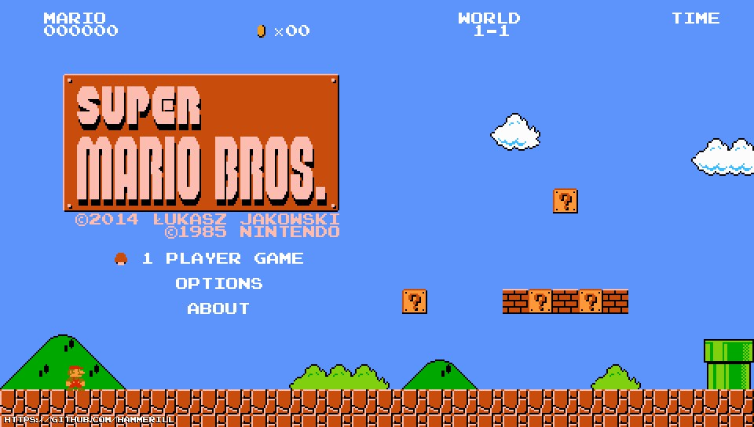

# uMario Vita
<p align="center"></p>

Another uMario port for PSVita.

## This is _another_ port
Yes, this game was ported before. I'm talking about [release by WeegeeDEVELOPER](https://github.com/WeegeeDEVELOPER/uMario-PSVita-Port).

And how it happened? Everything is simple - I've just started learning VITASDK and all related stuff. I was looking for something simple to begin with,
and found original uMario_Jakowski. It based on C++ with SDL2, the main things you can do Vita homebrew with. And just tried to compile it for Vita - successfully.
Then I've tried to adapt other things... And that's how this port born. 

But I didn't check one thing - does this port already exists. As you can understand, I've realized it only when I had port already at release state.
Eventually, I've decided to not abandon finished project, so I published it anyway.

Please don't mind anything - it's not the case when I copy someone's code and publish it under my name. This port is really _another_, 
you can make yourself sure with it just looking at commits.

## Controls
- <kbd>D-PAD</kbd> or <kbd>Left stick</kbd> -  controls in game and menu.
- <kbd>Cross</kbd> - jump in game and accept in menu.
- <kbd>Square</kbd> - run in game.
- <kbd>Circle</kbd> - dismiss in menu.
- <kbd>START</kbd> or <kbd>SELECT</kbd> - enter menu in game and dismiss in menu.

## Known issues 
1. Sometimes player becomes invincible and stays like that until restarting game or taking a star.
2. Sometimes some sounds are loud.
3. If you exit from or die in levels with fixed camera, camera will remain fixed until you exit the game (those three bugs might be legacy from original uMario_Jakowski).
4. Sometimes player spawns higher than they should (this allows player to climb at unavailable area right after spawn).
5. Due to wider screen you can see parts of levels that you normally shouldn't.

## Build and run
1. Install [VITASDK](https://vitasdk.org/).
2. Clone repo:
  ```
  git clone https://github.com/Hammerill/uMario_Vita && cd uMario_Vita
  ```
3. Build:
  ```
  cmake . && make
  ```
4. "uMario.vpk" file should appear. Copy this file to your hacked PS Vita and install via VitaShell.
5. Bubble "Mario" will appear, you can now launch this game.
